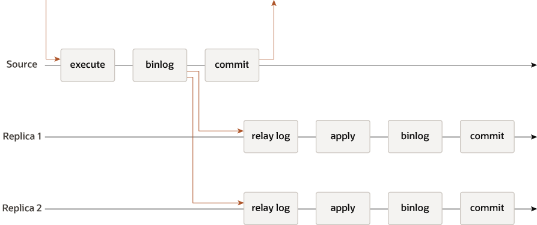
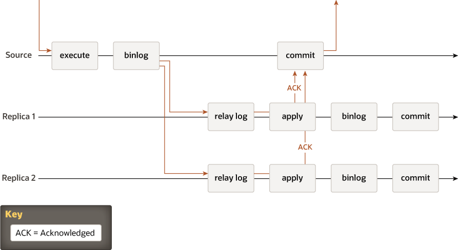
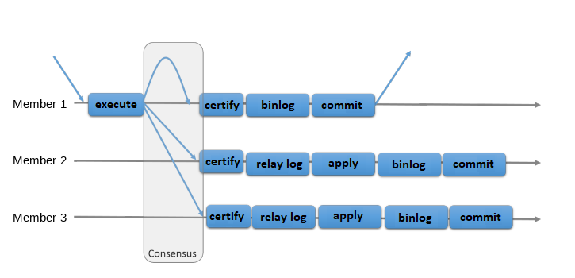
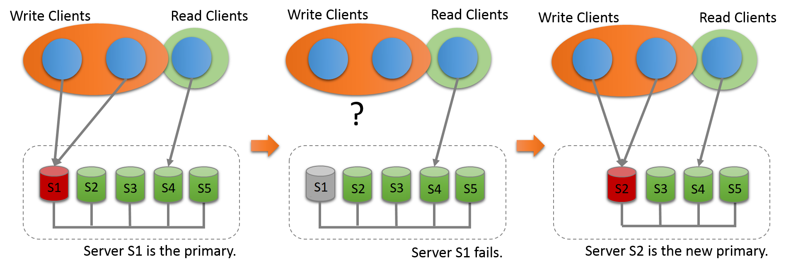
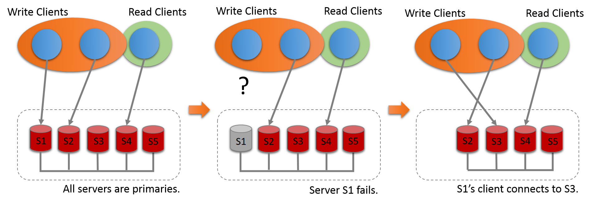

# Introduction to group replication based on mysql8.0

`MySQL Group Replication` 组复制 又称为`MGR`，是Oracle MySQL于2016年12月发布`MySQL5.7.17`,推出的意指使能够创建弹性、高可用性、容错的复制拓扑,组可以在具有自动主要选举的单主要模式
下运行，其中一次只有一台服务器接受更新。或者，可以在多主模式下部署组，其中所有服务器都可以接受更新，即使它们是同时发布的。有一个内置的组成员服务，可以使组的视图在任何给定时间点保持一致并可用于所有服务器。服务器可以离开和加入组，视图会相应更新。有时服务器可能会意外离开组，在这种情况下，故障检测机制会检测到这种情况并通知组视图已更改。这都是自动的。`MySQL Group Replication` 提供分布式状态机复制，服务器之间具有很强的协调性。当服务器属于同一组时，它们会自动进行自我协调。该组可以在具有自动主要选举的单主要模式下运行，其中一次只有一台服务器接受更新。或者，对于更高级的用户，可以在多主模式下部署该组，其中所有服务器都可以接受更新，即使它们是同时发布的。这种能力是以应用程序必须解决此类部署所施加的限制为代价的。

# 复制技术

## 从源到副本的复制

传统的 MySQL复制提供了一种简单的源到副本复制方法。 源是主服务器，并且具有一个或多个作为辅助服务器的副本。 源应用并提交事务，然后稍后（异步）将其发送到副本以重新执行（在基于语句的复制中）或应用（在基于行的复制中）。 它是一个无共享系统，这意味着每个服务器默认都有您的数据的完整副本。

当主库执行完一个事务，并且等到所有从库也执行完成这个事务的时候，主库在提交事务，并且返回数据给客户端。因为要等待所有从库都同步到主库中的数据才返回数据，所以能够保证主从数据的一致性，但是数据库的性能必然受到影响；

# 组复制

组复制是一种可用于实现容错系统的技术。 复制组是一组服务器，每个服务器都有自己的完整数据副本（无共享复制方案）并通过传递消息进行交互。 通信层提供了一组保证，例如原子和全序消息传递。 这些都是非常强大的属性，可以转化为非常有用的抽象，可以用来构建更高级的数据库复制解决方案。

**MySQL 组复制基于这些属性和抽象来在任何地方实现多源更新。 复制组由多台服务器组成，组内每台服务器可以在任何时候独立执行事务。 然而，每个读/写事务只有经过小组批准后才会提交。 这意味着对于读/写事务，提交操作不是来自原始服务器的单向决策，因为组必须决定是否提交。 只读事务不需要其组内的协调并且会立即提交。**

当原始服务器准备提交读/写事务时，它会原子地广播写入值（已更改的行）和相应的写入集（已更新行的唯一标识符）。 交易通过原子广播发送，以便组中的所有服务器都接收交易或都不接收交易。 如果收到，则所有交易都会按照与之前发送的其他交易相同的顺序接收。 因此，所有服务器都以相同的顺序接收同一组交易，从而为交易建立全局总顺序。

然而，在不同服务器上同时运行的事务之间可能会发生冲突。 通过检查和比较不同并发事务的写入集来检测此类冲突，这个过程称为认证。 在认证期间，冲突检测在行级别进行：当在不同服务器上运行的两个并发事务更新同一行时，就会发生冲突。 冲突解决程序是，首先在所有服务器上提交有序事务，然后中止有序事务，因此在原始服务器上回滚并由组中的其他服务器删除。 例如，如果 t1 和 t2 在不同站点同时执行，且都修改同一行，且 t2 排在 t1 之前，则 t2 赢得冲突并且 t1 被回滚。 这实际上是一个分布式的先提交获胜规则。如果两个事务必然会引起高度争议，那么最好在同一台服务器上启动它们。在这种情况下，就有机会与本地锁管理器同步，而不是由于证明而回滚。

为了确保保证事务的执行和外部化，组复制允许服务器偏离商定的事务顺序，只要这不损害一致性和有效性。 组复制是一个最终一致性系统。这意味着一旦传入流量减慢或停止，所有组成员的数据内容就会变得相同。 随着流量的流动，交易可能会以略有不同的顺序或在某些成员上进行外部化。 例如，在多主模式下，本地事务可能在证明之后立即被外部化，但之前处于全局顺序的远程事务尚未被应用。 如果证明过程确定交易之间没有冲突，则是允许的。 在单主模式下，主服务器上不冲突的并发本地事务可以按照与组复制同意的全局顺序不同的顺序提交和外部化。 在未接受客户端写入的辅助服务器上，事务始终按照商定的顺序提交和外部化。** 

下图说明了 MySQL 组复制协议：如果我们将其与 MySQL 复制（或 MySQL 半同步复制）进行比较，我们可以看到一些差异： 为了清楚起见，一些底层共识和 Paxos 相关消息未在此图中显示。

# 多主模式和单主模式

组复制可以在单主模式或多主模式下运行。 组模式是`group_replication_single_primary_mode`系统变量指定的组范围的配置设置，并且所有成员必须相同。`ON`表示单主模式（默认模式）`OFF`， 表示多主模式。 同一组内的成员不能以不同的模式部署。例如，您不能在多主模式下配置一个成员，而在单主模式下配置另一个成员。在组复制运行时，`group_replication_single_primary_mode`您无法手动更改的值。从 `MySQL 8.0.13` 开始，`group_replication_switch_to_single_primary_mode()`使用`group_replication_switch_to_multi_primary_mode()UDF`，可以在组复制运行时将组从一种模式移动到另一种模式。 这些 `UDF` 管理更改组模式的过程并确保您的数据安全且一致。 在以前的版本中，更改组模式`group_replication_single_primary_mode`需要停止组复制并更改所有成员的值。 然后，它对`group_replication_bootstrap_group=ON`组进行完全重启（使用引导服务器）以实施对新操作配置的更改。 无需重新启动服务器。

## 单主模式

在单主模式`（group_replication_single_primary_mode=ON）`下，组有一个以读/写模式配置的主服务器。 组中的所有其他成员都设置为只读模式`（super_read_only=ON使用）`。 主服务器通常是第一个引导该组的服务器。 加入该组的所有其他服务器都会了解主服务器，并自动设置为只读模式。
在单主模式下，组复制仅强制单个服务器写入组，因此与多主模式相比，一致性检查的限制较少，并且不需要对 `DDL`语句进行特殊处理。 该选项`group_replication_enforce_update_everywhere_checks`启用或禁用组的严格一致性检查。 如果以单主模式部署或将组更改为单主模式，OFF则必须将此系统变量设置为。

可以通过下列方式更改指定为主服务器的成员：

- 如果现有的主成员离开组，无论是自发的还是意外的，都会自动选择一个新的主成员。
- `group_replication_set_as_primary()`您可以使用 `UDF` 提名特定成员作为新的主要成员。
- `group_replication_switch_to_single_primary_mode()`如果您使用 `UDF` 将以多主模式运行的组更改为以单主模式运行，则会自动选择一个新的主组，或者您可以在 UDF 中指定提名一个新的主组。
仅当所有组成员都运行 `MySQL 8.0.13` 或更高版本时，`UDF` 才可用。 一旦自动选择或手动指定新的主服务器，它将自动设置为读/写，而其他组成员将保持为辅助服务器并保持只读。

当选择或指定新主服务器时，可能会有大量更改已应用于旧主服务器但尚未应用于此服务器。 在这种情况下，读/写事务可能会遇到冲突并被回滚，而只读事务可能会遇到陈旧读取，直到新的主服务器赶上旧的主服务器。 组复制的流控制机制可最大限度地减少快速成员和慢速成员之间的差异，从而在激活和适当调整时降低发生这种情况的可能性。 有关流量控制的更多信息，请参见[第 18.6.2 节“流量控制”](https://dev.mysql.com/doc/refman/8.0/ja/group-replication-flow-control.html) 。从 `MySQL 8.0.14 开始，group_replication_consistency`您还可以使用系统变量来配置事务一致性组级别，以避免此问题。`BEFORE_ON_PRIMARY_FAILOVER`（或更高的一致性级别），新的事务将被持久保存到新选举的主事务，直到积压事务被应用为止。 有关事务一致性的更多信息，请参见[第 18.4.2 节“事务一致性保证”](https://dev.mysql.com/doc/refman/8.0/ja/group-replication-consistency-guarantees.html) 。 如果该组未使用流控制和事务一致性保证，则建议您等待新的主服务器应用与复制相关的中继日志，然后再重新路由客户端应用程序。

## 主选择算法

在自动主要成员选择过程中，每个成员都会看到该组的新视图，对潜在的新主要成员进行排序，并选择最合适的成员。 每个成员根据 MySQL 服务器版本的主要选择算法，在本地做出自己的决定。 由于所有成员都必须做出相同的决定，如果其他组成员运行的是较低版本的 MySQL Server，则这些成员会调整其主要选择算法，使其行为与组中具有最低 MySQL Server 版本的成员相同。

会员在选择主要成员时考虑的因素包括：

- 首先考虑的因素是哪个成员正在运行最低版本的 MySQL Server。 如果所有组成员都运行 MySQL 8.0.17 或更高版本，则首先按该版本的补丁版本对成员进行排序。如果有成员运行 MySQL Server 5.7 或 MySQL 8.0.16 或更低版本，则成员将首先按主版本发布排序，忽略补丁版本。

- 如果多个成员正在运行最低版本的 MySQL Server，则考虑的第二个因素`group_replication_member_weight`是每个成员的成员权重，如成员的系统变量中所指定。 如果组中的任何成员正在运行 MySQL Server 5.7（其中此系统变量不可用），则会忽略此因素。

- `group_replication_member_weight`系统变量指定一个 0-100 范围内的数字。 所有成员的默认权重均为 50，因此，若要降低排名，请设置低于此值的权重，若要提高排名，请设置高于此值的权重。 此加权功能允许您优先使用更好的硬件，或在主服务器进行定期维护期间将故障转移到特定成员。

- 如果多个成员运行的是最低版本的 `MySQL Server`，并且其中多个成员具有最高权重（或忽略某个成员的权重），则第三个因素被`server_uuid`假定为每个成员生成的服务器 UUID 的字典顺序，由系统变量指定。 具有最低服务器 UUID 的成员被选为主成员。 这一因素起到了保证和可预测的约束区域的作用，以确保当所有小组成员由于关键因素而无法做出决定时，能够做出相同的决定。

> [!NOTE]
> `performance_schema.replication_group_members`使用表中的`MEMBER_ROLE`列 可以查看以单主模式部署时哪个服务器当前是主服务器

# 多主模式

在多主模式`（group_replication_single_primary_mode=OFF）`下，成员没有特殊角色。 与其他组成员兼容的成员在加入组时被设置为读/写模式，并且即使同时发出写入事务也可以处理它们。例如，由于服务器意外死亡而停止接受写入事务，连接到该成员的客户端可以被重定向或故障转移到处于读/写模式的其他成员。 组复制本身不处理客户端故障转移，因此您必须使用中间件框架`（如MySQL Router 8.0 、代理、连接器或应用程序本身）`来协调此事。图 18.5 “客户端故障转移”显示了当某个成员离开组时，客户端如何重新连接到备用组成员。

组复制是一个最终一致性系统。 这意味着一旦传入流量减慢或停止，所有组成员的数据内容就会变得相同。 在流量流动期间，特别是如果某些成员的写入吞吐量低于其他成员时，事务可能会在其他成员之前被外部化，从而导致读取过时的可能性。 多主模式还允许速度较慢的成员积累过多的交易积压以进行身份​​验证和应用，从而增加了冲突和证明失败的风险。 为了限制这些问题，您可以激活和调整组复制流控制机制，以尽量减少快速和慢速成员之间的差异。 有关流量控制的更多信息，请参见 第 18.6.2 节“流量控制” 。

从 MySQL 8.0.14 开始，如果要保证组内所有事务的事务一致性，`group_replication_consistency`可以使用系统变量来实现： 您可以选择适合您团队的工作负载和读写数据优先级的设置，同时考虑到提高一致性所需的同步对性能的影响。 您还可以为单个会话设置系统变量来保护特别敏感的交易。 有关事务一致性的更多信息，请参见 [第 18.4.2 节“事务一致性保证”](https://dev.mysql.com/doc/refman/8.0/ja/group-replication-consistency-guarantees.html) 。

## 事务检查

如果组以多主模式部署，则会检查事务以确保它们与该模式兼容。 当组复制以多主模式部署时，将执行以下严格的一致性检查：

- 当事务在 SERIALIZABLE 隔离级别运行时，当它尝试与组同步时提交会失败。

- 如果对具有带级联约束的外键的表执行事务，则在将事务本身与组同步时提交将失败。

该检查`group_replication_enforce_update_everywhere_checks`由系统变量控制。 在多主模式下，系统变量`ON`应设置为 `Normal`，但`OFF`您可以选择通过将系统变量设置为 来停用检查。 如果您以单主模式部署，`OFF`则必须将系统变量设置为。

## 数据定义语句

在多主模式组复制拓扑中，执行数据定义语句（也称为数据定义语言（DDL））时必须小心。

MySQL 8.0 引入了对原子数据定义语言 (DDL) 语句的支持，其中完整的 DDL 语句作为单个原子事务提交或回滚。 但是，任何 DDL 语句（原子或其他）COMMIT都会隐式结束当前会话中任何活动的事务，就像它在执行该语句之前已经执行一样。 也就是说，DDL 语句不能与另一个事务中的`START TRANSACTION ... COMMIT`其他语句组合 ，或者与其他事务控制语句内或同一个事务中的其他语句组合。

组复制基于乐观复制范式，其中语句以乐观方式执行，然后在必要时回滚。 每个服务器最初运行时都没有确保组协议。 因此，在多主模式下复制 `DDL` 语句时需要更加小心。如果您更改模式（使用 DDL）并且对于同一对象也更改对象中包含的数据（使用 DML），则必须在模式操作尚未完成且未在所有地方复制时通过同一服务器处理更改。 否则，当操作中断或仅部分完成时，可能会出现数据不一致的情况。 如果组以单主模式部署，则不会出现此问题。这是因为所有更改都是通过同一台服务器（主服务器）进行的。

有关 MySQL 8.0 中对原子 DDL 的支持以及对某些语句的复制行为的更改的信息，请参见 [第 13.1.1 节“对原子数据定义语句的支持”](https://dev.mysql.com/doc/refman/8.0/ja/atomic-ddl.html) 。

## 版本兼容性

为了获得最佳兼容性和性能，组中的所有成员都应运行相同版本的 MySQL 服务器，因此应该运行组复制。 在多主模式下这甚至更为重要，因为通常所有成员都以读/写模式加入组。 如果一个组包含运行多个 MySQL Server 版本的成员，则某些成员可能与其他成员不兼容，因为它们不支持或缺少其他成员所具有的功能。 为了防止这种情况，当新成员加入时（包括已升级和重新启动的先前成员），该成员会对组中的其余成员运行兼容性检查。

这些兼容性检查的一个结果在多主模式下尤为重要。 如果加入成员运行的 MySQL 服务器版本高于任何现有组成员运行的最低版本，则该成员将加入该组但仍处于只读模式。 （在单主模式下运行的组中，新添加的成员在两种情况下都默认为只读。）运行 MySQL 8.0.17 及更高版本的成员在检查兼容性时会考虑发布补丁版本。对于运行 MySQL 8.0.16 或更低版本或 MySQL 5.7 的成员，仅考虑主要版本。

在以多主模式运行的组中，如果成员使用不同的 MySQL Server 版本，组复制会自动管理运行 MySQL 8.0.17 及以上版本的成员的读写和只读状态。 当成员离开组时，当前运行最低版本的成员将自动设置为读/写模式。 如果将以单主模式运行的组更改为以多主模式运行，`group_replication_switch_to_multi_primary_mode()`则组复制会使用 UDF 自动将成员设置为正确的模式。 如果成员运行的 MySQL 服务器版本高于组中现有的最低版本，则该成员会自动进入只读模式，而运行最低版本的成员处于读/写模式。

# 组复制插件架构

`MySQL Group Replication` 是一个 MySQL 插件，它建立在现有的 MySQL 复制基础架构上，利用二进制日志、基于行的日志记录和全局事务标识符等功能。 它与当前的 MySQL 框架集成，包括性能模式、插件和服务基础设施。 下图是` MySQL Group Replication `整体架构图。

MySQL 组复制插件包括一组检索、应用和生命周期 API，用于控制插件如何与 MySQL 服务器交互。 有一些接口，信息通过这些接口从服务器流向插件，反之亦然。 这些接口将 MySQL 服务器核心与组复制插件分离，并且大多是放置在事务执行管道中的钩子。 有一个方向的通知，从服务器到插件，包括服务器启动、服务器恢复、服务器准备接受连接、服务器即将提交事务等事件的通知。 在另一个方向上，插件指示服务器采取行动，例如提交或中止正在进行的事务，或者在中继日志中排队事务。

组复制插件架构的下一层是一组在通知路由到它们时做出反应的组件。 捕获组件跟踪与正在进行的事务相关的上下文。应用程序组件在数据库上执行远程事务。 恢复组件管理分布式恢复、选择捐赠者、管理追赶程序以及响应捐赠者故障以获取组中最新的参与服务器。

继续沿着堆栈往下，复制协议模块包含复制协议的特定逻辑。 它处理冲突检测，并接收交易并将其传播到其组。

组复制插件架构的最后两层是组通信系统 `(GCS) API`和基于 `Paxos` 的组通信引擎 `(XCom)` 实现。 `GCS API` 是一种高级 `API`，它抽象了构建复制状态机所需的属性（参见第 18.1 节“组复制背景” ）。 这将消息传递层的实现与插件的其余较高层分离。 组通信引擎处理与复制组成员的通信。
